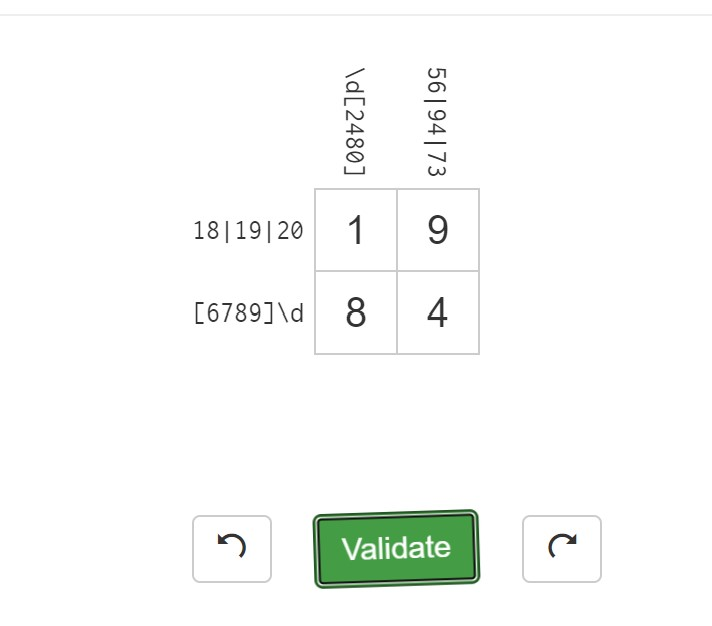
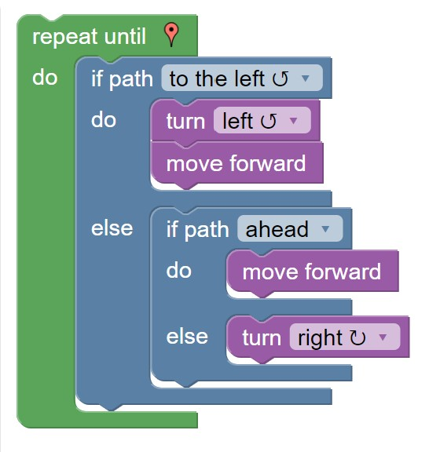

# Lab 01 Report - Introduction to Open Source Software

#### Name: Neha Deshpande
#### Email: deshpn2@rpi.edu 
#### Github account: neha-deshpande001
#### Discord handle: neha#7082

## Part 1

## Part 2
### 2.3
1. Answer the question clearly and concisely, don't give irrelevant details that wouldn't help guide the person in the right direction.
2. Include instructions for multiple operating systems, because many different people could be having the same problem and each system would resolve it differently.

### 2.4
It is undoubtedly unfair that Jesse Jordan, a student who spent his free time experimenting with software, got sued for 15 million dollars. The network that he was hosting was intended for RPI-related files, not any music. It was not his fault and he was unaware that people were using his software to pirate music illegally. It makes sense that he agreed to the settlement for $12,000 rather than paying a lot more legal fees, which will not result in anything. The lesson here is that it is important to be careful with software, especially when dealing with large corporations. If you want to host a network to hold any files, it is important to ensure that the files are all legally allowed to be distributed and used. Ensure that the files are open sourced and that you will not get in trouble for distribution if you put them on a public network. If any files are not allowed to be distributed, they should be filtered out and not put on the public network. 

## Part 3
### 3.3

## Part 4
### 4.1
:(

### 4.2

## Part 5

## Part 6
From the link provided, I saw that one of the possible open source projects was Firefox. This is interesting to me because I've used it a lot in the past and am very familiar with it. Since it is open source, it would be interesting to take a look at the code base and understand what is going on.
